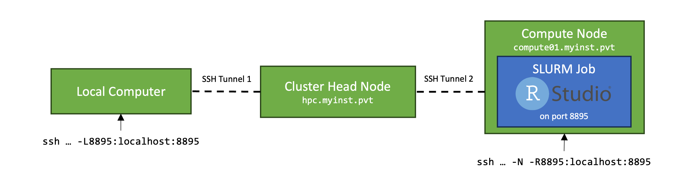

# FileForward: A python utility for forwarding TCP traffic via an HPC shared filesystem.

This is a Python-based client/server utility for forwarding TCP traffic via a shared/networked filesystem (like on an HPC system).

Why? See '[Why does this exist?](#why-does-this-exist)'. 

Although it is intended for an HPC-specific use case, it should theoretically allow you to forward arbitrary TCP traffic between computers connected to the same shared filesystem.

> [!NOTE]
> Before using, please read the '[Should I use this?](#should-i-use-this)' and '[Caveats and Disclaimers](#caveats-and-disclaimers)' sections.

## Prerequisites

In order for this utility to work correctly, the networked file system + clients must support the `lockf` system call.

Empirically, I've used this utility successfully on NFS filesystems, but had issues with a Samba-based system.  

## How to Install and Run

You can either clone this repository, or install the package via pip:

`pip install git+https://github.com/Andrew0Hill/file_forward.git`

In order of convenience, you can:
1. Run the `fileforward` executable (if you installed with pip)
2. Run `python -m fileforward`
3. Import the `TunnelClient` and `TunnelServer` objects for use in your own Python scripts.

For the below examples, I'll assume you're running using the first option (`fileforward` executable), but arguments are the same regardless of how you run the program.

## Starting the Server/Client

The `fileforward` server should run on the system which will receive the incoming local connection. In an HPC context, this is the head node. 

An example server command looks like:

```shell
fileforward --server --port 8888 --tunnel_dir ~/ff_tunnel
```

This command will:
- `--server` - Run in server mode.
- `--port 8888` - Listen on port 8888.
- `--tunnel_dir ~/ff_tunnel` - Use `~/ff_tunnel` for connection traffic. (Obviously, this directory needs to be under shared/networked mount).

The `fileforward` client should run on the same system which is running your web service, IDE, whatever you want to connect to.

An example command looks like:

```shell
fileforward --client --port 8888 --tunnel_dir ~/ff_tunnel
```

- `--client` - Run in client mode.
- `--port 8888` - Forward incoming traffic to port 8888.
- `--tunnel_dir ~/ff_tunnel` - Use `~/ff_tunnel` for connection traffic. 

## Considerations for HPC Usage

### Local Port Forwarding
If you are running on an HPC, you will need to forward a local port from your machine to the HPC head node, using a command like:

```shell
ssh -L8888:localhost:8888 myuser@myhost
```

This will enable you to connect to the `fileforward` server running on HPC head node from your local browser.

### Client Startup
In an HPC job context, it is easiest to start the `fileforward` client in your SLURM batch script (or your HPC equivalent) like:

```shell
#!/bin/bash
#SBATCH --job-name=myjob
JUPYTER_PORT=8888
...
trap "kill 0" EXIT
...
fileforward --client --port $JUPYTER_PORT --tunnel_dir ~/my_tunnel &
...
jupyter lab --port $JUPYTER_PORT --no-browser
 
```

In this example, the `fileforward` command is sent to the background with `&`.

The script then launches the IDE running on the same port.

The `trap` line sends a signal which will kill the background `fileforward` process when the job ends.

## Why does this exist?
Here's my use case:
- I am a regular user of HPC systems, which regulate access to high-resource compute nodes via job submission (SLURM, etc.).
- I am also a regular user of JupyterLab and RStudio, web-based interactive IDEs ideal for running short analyses, visualizations, etc.

### SSH Tunneling
To run an interactive IDE on an HPC system, my typical workflow looks something like this:



1. Configure SSH to forward traffic on a local port to the head node of the HPC (local -> Head Node)
2. Submit a SLURM job script which:
   1. Launches the interactive IDE
   2. Opens a second SSH tunnel back to the HPC head node (Compute Node -> Head Node)  

This allows you to access the IDE running on the compute node from your local browser, just as you would if you were running the IDE locally.

### If SSH tunneling works fine, what's the problem?
The SSH tunneling approach *is* ideal and if you can get it working on your HPC I recommend you go this route instead of using this utility. 

However:
1. Many HPC systems specifically restrict SSH access between nodes to prevent users from circumventing the job submission system.
2. The SSH tunneling approach requires configuring SSH key login between the compute and head nodes (so the Remote SSH tunnel can be opened automatically in a script).

FileForward **replaces** `SSH Tunnel 2` from the diagram, enabling it to work on HPC systems even if inter-node SSH connections are restricted. 


## Should I use this?

To be honest, I would treat this utility as a last resort. If you have a similar use case to my own (connection forwarding on HPC clusters), I would first try an SSH-based solution (See [SSH Tunneling](#ssh-tunneling)). The SSH-based solution is marginally more complex to configure, it should be much faster and less resource intensive.

If SSH tunneling *doesn't* work on your system, then feel free to give this a try.

## Alternatives

I will keep this section updated with any alternatives projects that have similar functionality.

[FileTunnel](https://github.com/fiddyschmitt/File-Tunnel) - Seems like a much more mature (and likely more performant) solution to this problem.

## Caveats and Disclaimers
- I wrote this mostly as a way to get more comfortable with Python's `asyncio` capabilities. This type of utility would probably be better implemented in a different language and indeed there are other projects (See [Alternatives](#alternatives)) which are likely more robust/mature/performant than this tool.
  - In my testing, performance is slow(er than SSH) but usable for things like JupyterLab. I have not tested it for any high-traffic use-cases.
- There are various parameters which you can tweak (polling rates, lock acquisition backoff attempts, etc.) that may improve performance. I've set the defaults at what I think are reasonable values, but I haven't done extensive I/O impact testing, so I may change them in the future.
- **Network file systems are not really intended for this type of thing.**
  - If you do change the default parameter values, please try to choose values that are respectful of the shared resource (and please don't blame me if your sysadmin yells at you).  


